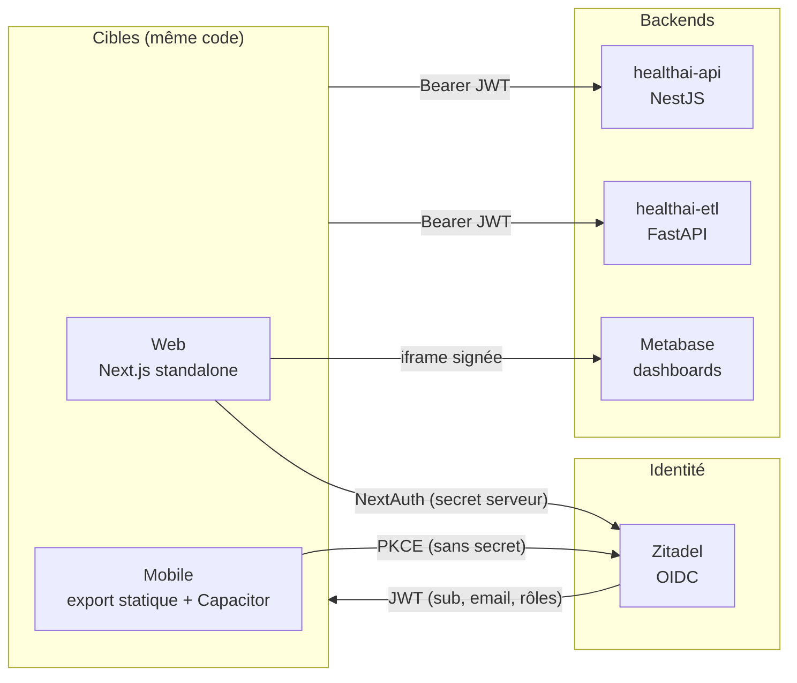

<div align="center">

# HealthAI Web

**Interface d'administration de la plateforme HealthAI Coach** — monitoring des pipelines ETL, analytics, gestion et validation des données. Disponible en **web** et en **application mobile** (Android / iOS) depuis la même base de code.

[](https://github.com/HealthAI-Corpo/healthai-web/actions/workflows/ci.yml)
[](https://nextjs.org)
[](https://react.dev)
[](https://www.typescriptlang.org)
[](https://capacitorjs.com)
[](https://www.conventionalcommits.org)

[Architecture](#architecture) · [Démarrage rapide](#démarrage-rapide) · [Authentification](#authentification) · [Cible mobile](#cible-mobile-capacitor) · [CI/CD](#cicd)

</div>

---

## Sommaire

- [Architecture](#architecture)
- [Stack technique](#stack-technique)
- [Démarrage rapide](#démarrage-rapide)
- [Variables d'environnement](#variables-denvironnement)
- [Authentification](#authentification)
- [Cible mobile (Capacitor)](#cible-mobile-capacitor)
- [Accessibilité (RGAA AA)](#accessibilité-rgaa-aa)
- [Qualité & tests](#qualité--tests)
- [CI/CD](#cicd)
- [Structure du projet](#structure-du-projet)

---

## Architecture



Une **seule base de code** produit deux cibles, pilotées par `NEXT_PUBLIC_APP_TARGET` :

| | Web (`web`) | Mobile (`mobile`) |
|---|---|---|
| Build Next.js | `standalone` (serveur) | `export` (statique) |
| Auth | NextAuth + middleware serveur | PKCE client + guard client |
| Analytics | iframe Metabase | charts alimentés par l'API |
| Packaging | Docker / ghcr.io | APK / IPA via Capacitor |

---

## Stack technique

| Couche | Technologie |
|---|---|
| Framework | Next.js 15 (App Router) · React 19 |
| Langage | TypeScript 5 |
| Styling | Tailwind CSS 3 · CSS variables |
| Composants | Radix UI (accessibles) · Recharts · TanStack Table 8 |
| Data fetching | TanStack Query 5 |
| Formulaires | React Hook Form · Zod |
| Identité | Zitadel — NextAuth 5 (web) · PKCE OIDC (mobile) |
| Mobile | Capacitor 8 (Android / iOS) |
| Tests | Vitest (unitaires) · Playwright + axe-core (E2E) |
| Design system | Storybook |
| Qualité | ESLint · Prettier · react-doctor |

---

## Démarrage rapide

### Prérequis

- Node.js 20+
- Une instance Zitadel (auth) et, idéalement, [healthai-api](https://github.com/HealthAI-Corpo/healthai-api) en local

### Installation

```bash
# 1. Dépendances
npm install

# 2. Configuration
cp .env.example .env.local        # puis éditer les valeurs

# 3. Serveur de développement (cible web)
npm run dev
# → http://localhost:3000
```

### Cible mobile en local

```bash
npm run dev:mobile                # même app, auth PKCE, guard client
```

### Build production (web)

```bash
npm run build && npm run start
```

---

## Variables d'environnement

### Web

| Variable | Description |
|---|---|
| `AUTH_SECRET` | Secret NextAuth (`openssl rand -base64 32`) |
| `AUTH_URL` | URL publique du front (ex. `http://localhost:3000`) |
| `ZITADEL_ISSUER` | URL de l'instance Zitadel |
| `ZITADEL_CLIENT_ID` | Client ID de l'app **Web** Zitadel |
| `ZITADEL_CLIENT_SECRET` | Secret de l'app Web |
| `NEXT_PUBLIC_NESTJS_URL` | URL de l'API NestJS |
| `NEXT_PUBLIC_FASTAPI_URL` | URL de l'ETL FastAPI |
| `NEXT_PUBLIC_METABASE_URL` | URL Metabase (analytics web) |

### Mobile (en plus)

| Variable | Description |
|---|---|
| `NEXT_PUBLIC_APP_TARGET` | `mobile` pour activer la cible native |
| `NEXT_PUBLIC_ZITADEL_ISSUER` | URL de l'instance Zitadel |
| `NEXT_PUBLIC_ZITADEL_CLIENT_ID` | Client ID de l'app **Native** Zitadel (PKCE) |
| `NEXT_PUBLIC_ZITADEL_OIDC_SCOPES` | `openid profile email offline_access` |
| `NEXT_PUBLIC_MOBILE_REDIRECT_URI` | `com.healthai.coach://auth/callback` |

> Les variables `NEXT_PUBLIC_*` sont **injectées au build** : les changer après coup nécessite un rebuild. Modèle complet : [`.env.example`](.env.example).

---

## Authentification

L'identité est entièrement déléguée à **Zitadel**. Le front ne stocke aucun mot de passe ; chaque appel backend porte un Bearer JWT.

| Cible | Flux | Secret ? | Garde d'accès |
|---|---|---|---|
| **Web** | NextAuth — Authorization Code | oui (côté serveur) | `middleware.ts` (serveur) |
| **Mobile** | **PKCE** — Authorization Code + code challenge | non | `RouteAccessGuard` (client) |

Les deux aboutissent au **même JWT Zitadel**, validé de façon identique par l'API et l'ETL. La logique d'autorisation est mutualisée dans [`src/lib/auth/helpers.ts`](src/lib/auth/helpers.ts) (`extractRole`, `getRedirect`, `isPublicPath`) — testée unitairement et réutilisée par le middleware web **et** le guard mobile.

**Rôles** : le claim `urn:zitadel:iam:org:project:roles` distingue `admin` de `user`. Les routes du groupe `(admin)` (`/datasets`, `/exports`, `/validation`) sont réservées au rôle `admin`.

**Provisioning JIT** : au premier login, le front appelle `POST /utilisateurs/sync` sur l'API pour créer l'utilisateur en base (non bloquant).

---

## Cible mobile (Capacitor)

```bash
# Export statique + sync vers les projets natifs
npm run cap:sync:android      # ou cap:sync:ios

# Ouvrir dans Android Studio / Xcode
npm run cap:open:android      # ou cap:open:ios

# APK debug en ligne de commande
cd android && ./gradlew assembleDebug
# → android/app/build/outputs/apk/debug/app-debug.apk
```

**Détails d'implémentation :**

- [`scripts/mobile-build.mjs`](scripts/mobile-build.mjs) écarte temporairement `middleware.ts` et `app/api` (interdits en export statique), build, puis restaure
- Login PKCE dans [`src/lib/auth/mobile-oidc.ts`](src/lib/auth/mobile-oidc.ts) (code challenge S256, validation du `state`)
- Retour OAuth via deep link `com.healthai.coach://auth/callback`, intercepté par [`NativeAppBridge`](src/lib/auth/NativeAppBridge.tsx)
- Session stockée côté client ([`auth-session.ts`](src/lib/auth/auth-session.ts))

**App Zitadel dédiée au mobile** : type **Native**, méthode d'auth **None** (PKCE), redirect URI `com.healthai.coach://auth/callback`, Auth Token Type **JWT**, rôles dans l'access token. Distincte de l'app Web, mais dans le même projet (audience + rôles communs).

L'APK est construit et attaché aux GitHub Releases automatiquement ([voir CI/CD](#cicd)).

---

## Accessibilité (RGAA AA)

- Skip link (`Aller au contenu principal`) sur toutes les pages
- Navigation clavier complète (`focus-visible`)
- `aria-current="page"` sur le lien actif, `aria-sort` sur les colonnes triables
- `aria-live="polite"` sur les notifications, `role="alert"` sur les erreurs
- Contraste WCAG AA vérifié via **axe-core** dans les tests Playwright

---

## Qualité & tests

```bash
npm run lint            # ESLint (max-warnings 0)
npm run format          # Prettier
npm run test            # Vitest (tests unitaires)
npm run test:e2e        # Playwright + axe-core (E2E + accessibilité)
npm run doctor          # react-doctor (santé du codebase)
npm run storybook       # design system → http://localhost:6006
```

---

## CI/CD

```
PR → develop          lint + tests (status check « CI » requis)
develop → main        PR obligatoire depuis develop (check-source-branch)
tag v*                build & push Docker ghcr.io
                      build APK Android → attaché à la GitHub Release
                      release + changelog (git-cliff)
```

| Workflow | Rôle |
|---|---|
| `ci.yml` | ESLint · Vitest · Playwright · build Docker · build APK · release |
| `commitlint.yml` | Convention de commits imposée sur les PRs |
| `check-source-branch.yml` | Les PRs vers `main` doivent venir de `develop` |

---

## Structure du projet

```
src/
├── app/
│   ├── (dashboard)/        # overview · analytics · pipelines
│   ├── (client)/           # dashboard · nutrition · sport · suivi
│   ├── (admin)/            # datasets · validation · exports  (rôle admin)
│   ├── login/              # page de connexion
│   ├── mobile-auth/        # callback OIDC mobile
│   └── api/                # routes serveur (web uniquement)
├── components/
│   ├── ui/                 # composants génériques (+ stories)
│   ├── tables/             # DataTable TanStack
│   ├── layout/             # Sidebar, PageHeader
│   └── navigation/         # RootRedirect
├── lib/
│   ├── auth/               # NextAuth (web) + PKCE/session/guard (mobile)
│   │   ├── helpers.ts      #   logique partagée (rôle, redirections)
│   │   ├── mobile-oidc.ts  #   flux PKCE natif
│   │   ├── auth-session.ts #   session mobile (localStorage)
│   │   └── AuthProvider.tsx#   provider double cible
│   ├── api/                # clients API (NestJS, ETL)
│   ├── hooks/              # TanStack Query
│   └── runtime.ts          # détection de la cible (web/mobile)
├── middleware.ts           # guard serveur (web — écarté en build mobile)
└── types/
scripts/mobile-build.mjs    # build export statique mobile
android/ · ios/             # projets natifs Capacitor
e2e/                        # tests Playwright
```

---

<div align="center">
<sub>HealthAI Coach — projet MSPR · <a href="https://github.com/HealthAI-Corpo">HealthAI-Corpo</a></sub>
</div>
